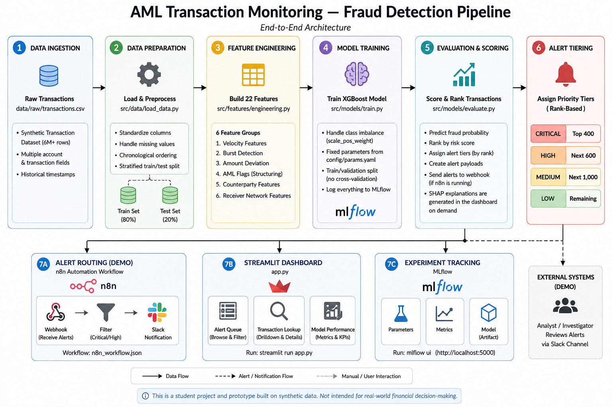
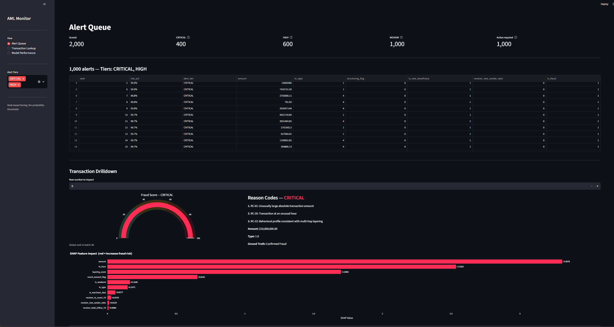
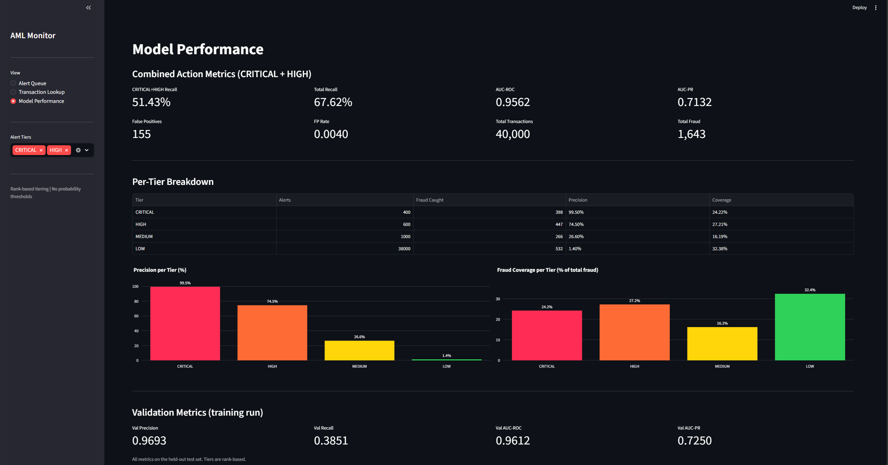
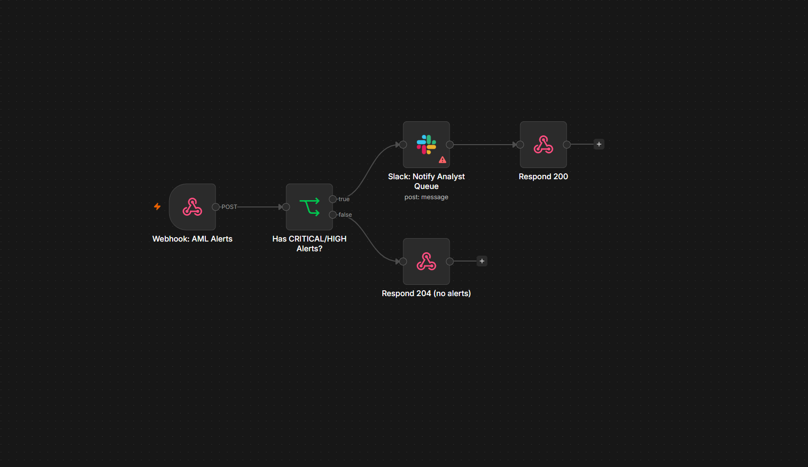

# AML Transaction Monitoring — Fraud Detection Pipeline

An end-to-end machine learning pipeline that scores financial transactions for fraud risk, assigns priority alert tiers, and routes high-risk alerts through an automation workflow. Built as a hands-on applied AI project using a large synthetic transaction dataset.


<!-- Optional: add a LICENSE file (MIT recommended) and then uncomment the line below -->
<!--  -->

---

## Why I Built This

I wanted to understand how fraud detection systems actually work under the hood — not just the model, but the full pipeline: how features are engineered from raw transactions, how imbalanced labels affect training, how to prioritise alerts when you can't review everything, and how to explain a model's decision to a non-technical reviewer. This project is my attempt to build all of that end-to-end, from raw data to a working dashboard, using tools that are commonly used in real ML engineering work.

---

## Table of Contents

- [What This Project Does](#what-this-project-does)
- [Features](#features)
- [How It Works](#how-it-works)
- [Alert Tier System](#alert-tier-system)
- [Setup](#setup)
- [Running the Pipeline](#running-the-pipeline)
- [Dashboard](#dashboard)
- [MLflow Experiment Tracking](#mlflow-experiment-tracking)
- [Alert Routing with n8n](#alert-routing-with-n8n)
- [Configuration](#configuration)
- [Project Structure](#project-structure)
- [Dataset](#dataset)
- [Limitations](#limitations)
- [Future Improvements](#future-improvements)
- [Author](#author)

---

## What This Project Does

Financial transaction datasets are often large and highly imbalanced, making fraud detection a challenging problem. This project builds a prototype fraud-alert pipeline that:

1. Engineers 22 behavioural features per transaction (spending velocity, timing, recipient network signals, AML-specific flags)
2. Trains an XGBoost classifier with dynamic class-weight scaling to handle the imbalanced fraud rate (~4%)
3. Assigns every transaction a fraud score and groups alerts into four priority tiers by rank
4. Explains each alert using SHAP reason codes so reviewers understand why a transaction was flagged
5. Demonstrates an end-to-end alert routing demo using n8n — high-risk alerts are dispatched to a Slack channel as a proof-of-concept automation workflow
6. Provides a Streamlit dashboard for browsing, investigating, and explaining flagged transactions

---

## Features

| Feature | Description |
|---------|-------------|
| **ML Fraud Scoring** | XGBoost classifier trained on a large synthetic transaction dataset |
| **22 Engineered Features** | Velocity, burst detection, network signals, structuring flags |
| **Rank-Based Alert Tiers** | CRITICAL / HIGH / MEDIUM / LOW — no fixed probability threshold |
| **SHAP Explainability** | Per-alert reason codes linked to the top contributing features |
| **n8n Alert Routing (demo)** | Prototype workflow: webhook → filter → Slack notification |
| **MLflow Tracking** | All training runs logged with parameters, metrics, and artifacts |
| **Streamlit Dashboard** | Alert queue, transaction drilldown, and model performance views |

---

## How It Works



```
data/raw/transactions.csv
        │
        ▼
src/data/load_data.py          — standardise columns, split train/test
        │
        ▼
src/features/engineering.py    — build 22 behavioural features
        │
        ▼
src/models/train.py            — train XGBoost, log run to MLflow
        │
        ▼
src/models/evaluate.py         — score test set, assign tiers, dispatch alerts
        │
        ├──► n8n webhook (demo) — route CRITICAL/HIGH alerts to Slack
        │
        └──► app.py             — Streamlit dashboard for review
```

---

## Alert Tier System

Each transaction is scored and assigned a tier based on its global rank — not a fixed probability threshold. This means the tier boundaries are configurable budget parameters, not model outputs.

| Tier | Count (default) | Suggested action |
|------|----------------|-----------------|
| 🔴 CRITICAL | Top 400 | Manual review |
| 🟠 HIGH | Next 600 | Priority queue |
| 🟡 MEDIUM | Next 1,000 | Soft flag |
| 🟢 LOW | Remaining | No action |

Tier sizes are set in `config/params.yaml` under `alerts.tier_k` and can be adjusted to match any review capacity.

---

## Setup

**Requirements:** Python 3.9+

```bash
# Create and activate a virtual environment
python -m venv venv
venv\Scripts\activate        # Windows
source venv/bin/activate     # macOS / Linux

# Install dependencies
pip install -r requirements.txt
```

---

## Running the Pipeline

Run each step in order. All outputs are saved locally — no external services required for the core pipeline.

### 1. Load data
```bash
python src/data/load_data.py
```
Reads `data/raw/transactions.csv`, standardises column names, and writes stratified train/test splits to `data/processed/`.

---

### 2. Feature engineering
```bash
python src/features/engineering.py
```
Builds 22 features across six groups:

| Group | What it captures |
|-------|-----------------|
| Velocity | How active has this account been in the last 7 days / 24 hours? |
| Burst detection | Did this account send many transfers in a single time step? |
| Amount deviation | Is this amount unusually large compared to the sender's history? |
| AML flags | Is the amount just below the $10,000 reporting threshold (structuring)? |
| Counterparty | Is this the sender's first time sending to this recipient? |
| Receiver network | Is this receiver collecting money from many different first-time senders? |

All rolling window features use past-only data — no future leakage.

---

### 3. Train
```bash
python src/models/train.py
```
Trains XGBoost with `scale_pos_weight` computed automatically from the training class distribution. Logs hyperparameters, validation metrics, and the model artifact to MLflow.

---

### 4. Evaluate
```bash
python src/models/evaluate.py
```
Scores the held-out test set, assigns tiers, prints a report, and (if n8n is running) dispatches CRITICAL/HIGH alerts to the webhook.

Sample output:
```
  Batch summary
  Total transactions         40,000
  True fraud cases            1,643
  Fraud rate                  4.11%

  Tier     Alerts   Fraud  Precision  Coverage
  CRITICAL    400     398     99.50%    24.22%
  HIGH        600     447     74.50%    27.21%
  MEDIUM    1,000     266     26.60%    16.19%
  LOW      38,000     532      1.40%    32.38%

  AUC-ROC   0.9562
  AUC-PR    0.7132
```

---

## Dashboard

```bash
streamlit run app.py
```

Opens at `http://localhost:8501`.

| View | Description |
|------|-------------|
| Alert Queue | Ranked list of flagged transactions with tier badges |
| Transaction Lookup | Score any transaction and see SHAP reason codes |
| Model Performance | Per-tier precision, recall, AUC-ROC, and AUC-PR |

**Alert Queue — ranked transactions with fraud score gauge and SHAP drilldown:**


**Model Performance — per-tier precision, recall, and AUC metrics:**


---

## MLflow Experiment Tracking

```bash
mlflow ui
```

Opens at `http://localhost:5000`. Shows all training runs with logged parameters, validation metrics, and saved model artifacts.

---

## Alert Routing with n8n

This is a demo automation workflow — not a real bank system. It shows how the evaluation pipeline could be connected to a notification tool.

**Start n8n:**
```bash
# via Docker (recommended)
docker run -it --rm -p 5678:5678 n8nio/n8n

# via Node.js
npx n8n
```

**Import the workflow:**
1. Open `http://localhost:5678`
2. Click **⋮ → Import from file** and select `n8n_workflow.json`
3. Add Slack credentials to the **Slack: Notify Analyst Queue** node (optional)
4. Toggle **Active** to enable

**Workflow logic:**

```
POST /webhook/aml-alerts
        │
        ▼
Has CRITICAL/HIGH alerts?
        │
   yes ─┴─ no
   │         └──► Respond 204 (skip)
   ▼
Slack: post summary to #aml-alerts
        │
        ▼
Respond 200
```

**n8n workflow canvas:**



**To skip n8n entirely**, set `n8n.enabled: false` in `config/params.yaml`.

---

## Configuration

All parameters are in `config/params.yaml`.

| Parameter | Default | Description |
|-----------|---------|-------------|
| `data.sample_size` | `200000` | Rows to use (`null` = all 6.36M) |
| `data.random_seed` | `42` | Reproducibility seed |
| `alerts.tier_k.critical_k` | `400` | Number of CRITICAL alerts |
| `alerts.tier_k.high_k` | `600` | Number of HIGH alerts |
| `alerts.tier_k.medium_k` | `1000` | Number of MEDIUM alerts |
| `model.params.n_estimators` | `500` | XGBoost trees |
| `model.params.max_depth` | `6` | Tree depth |
| `n8n.enabled` | `true` | Enable/disable webhook routing |
| `n8n.webhook_url` | `http://localhost:5678/...` | n8n webhook endpoint |

---

## Project Structure

```
.
├── app.py                        # Streamlit dashboard
├── n8n_workflow.json             # Importable n8n automation workflow
├── requirements.txt
├── config/
│   └── params.yaml               # All pipeline parameters
├── src/
│   ├── data/
│   │   └── load_data.py          # Data loading and train/test split
│   ├── features/
│   │   └── engineering.py        # 22-feature engineering pipeline
│   ├── models/
│   │   ├── train.py              # XGBoost training with MLflow logging
│   │   └── evaluate.py           # Evaluation, tiering, n8n routing
│   ├── pipeline/
│   │   ├── tiering.py            # Rank-based tier assignment logic
│   │   └── webhook.py            # n8n webhook dispatcher
│   └── explainability/
│       └── shap_explainer.py     # SHAP TreeExplainer + reason codes
├── docs/
│   └── n8n_workflow_canvas.png   # n8n workflow screenshot
├── data/
│   ├── raw/                      # Source CSV (gitignored)
│   └── processed/                # Engineered splits (gitignored)
├── models/                       # Saved model artifact (gitignored)
└── reports/                      # Evaluation metrics and scored output (gitignored)
```

---

## Dataset

This project uses the [PaySim synthetic financial dataset](https://www.kaggle.com/datasets/ealaxi/paysim1) (~6.36 million rows). It simulates mobile money transactions and includes labelled fraud cases.

The dataset contains several money laundering patterns used as learning signals:

- **Structuring** — amounts kept just below the $10,000 reporting threshold
- **Rapid bursts** — many transfers from the same account in a short window
- **New beneficiaries** — first-time transfers to previously unseen recipients
- **Mule accounts** — receivers that accumulate funds from many different senders
- **Layering proxies** — transaction patterns consistent with multi-hop fund movement

> This is synthetic/simulated data. It does not represent real transactions from any financial institution.

---

## Limitations

This is a student project and prototype — not a production banking system.

- **Synthetic data only.** The dataset is simulated. Model performance on real transaction data would need to be validated separately.
- **Tier sizes are manual budget parameters.** Alert counts (400 CRITICAL, 600 HIGH, etc.) are not learned — they are configuration values that must be set based on reviewer capacity.
- **51% recall at CRITICAL+HIGH is a budget constraint.** With 1,000 alert slots and 1,643 fraud cases, it is not possible to catch all fraud — the model correctly prioritises the most likely cases within the budget.
- **No drift detection.** There is no monitoring for data or concept drift over time.
- **No cold-start handling.** New accounts with no transaction history receive weakly informative velocity features.
- **n8n/Slack routing is a demo.** The webhook workflow demonstrates the concept but is not hardened for reliability, retries, or scale.
- **Rolling windows use step counts, not real time.** The dataset uses a step-based clock (1 step = 1 hour). Behaviour may differ on datasets with irregular time distributions.

---

## Future Improvements

- Add graph-based features or a GNN layer to detect multi-hop laundering chains
- Add data drift monitoring (e.g. Population Stability Index) with retraining triggers
- Improve dashboard filtering — filter by date range, amount, transaction type
- Add a Docker Compose setup to run n8n + Streamlit together
- Add unit tests and a basic CI pipeline
- Experiment with LightGBM or CatBoost as alternative classifiers
- Add model monitoring for score distribution shifts over batches
- Validate on a second dataset to test generalisation

---

## Author

**Rahil Dobariya**  
Applied AI student  
📧 dobariyarahil111@gmail.com
